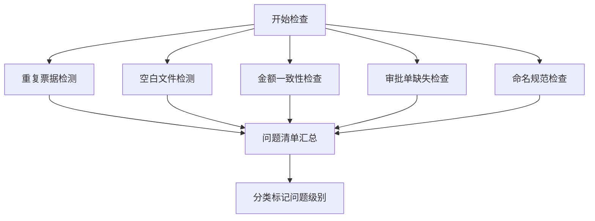

# 财务报销附件整理工具 - 产品需求文档

## 1. 产品概述

财务报销附件整理工具是一款面向财务助理的自动化办公工具，旨在解决每月报销附件人工整理效率低、易出错的问题。工具通过六步工作流（导入文件夹→识别发票类型→按人员归类→重命名→缺失检查→汇总导出），自动完成报销单据的分类、命名、校验和汇总工作。

- **目标用户**：企业财务助理、行政人员
- **核心价值**：减少人工逐个核对的时间，降低出错率，实现报销附件的规范化管理

## 2. 核心功能

### 2.1 用户角色

| 角色 | 注册方式 | 核心权限 |
|------|----------|----------|
| 财务助理 | 本地工具，无需注册 | 导入文件、整理分类、检查校验、导出结果 |

### 2.2 功能模块

1. **导入文件夹**：选择本地目录，扫描支持的文件类型
2. **智能识别**：自动识别发票类型、提取关键信息（金额、日期、人员等）
3. **分类整理**：按员工姓名、月份、金额区间、项目名称等维度归类
4. **批量重命名**：根据命名规范自动重命名文件
5. **缺失检查**：检查重复票据、空白文件、金额不一致、缺少审批单、命名不规范
6. **汇总导出**：生成规范文件夹、问题清单、报销汇总表、可回退记录

### 2.3 页面详情

| 页面名称 | 模块名称 | 功能描述 |
|----------|----------|----------|
| 主工作台 | 步骤导航 | 六步流程可视化导航，显示当前进度 |
| 主工作台 | 导入区域 | 文件夹选择器、文件列表预览、支持拖拽 |
| 主工作台 | 识别配置 | 发票类型映射、识别规则设置 |
| 主工作台 | 分类配置 | 分类维度选择（人员/月份/金额/项目）、规则设置 |
| 主工作台 | 命名配置 | 命名模板设置、预览效果 |
| 主工作台 | 检查面板 | 问题类型筛选、问题列表、问题详情 |
| 主工作台 | 导出面板 | 导出选项、导出进度、结果预览 |

## 3. 核心流程

### 3.1 主工作流程

用户从导入文件夹开始，依次经过六个步骤，每步完成后可进入下一步，也可返回上一步修改。最终导出整理结果和问题报告。

### 3.2 检查校验流程

## 4. 用户界面设计

### 4.1 设计风格

- **主色调**：深蓝色系（#1565c0），传递专业、可信赖的财务工具形象
- **辅助色**：绿色表示正常、橙色表示警告、红色表示错误
- **设计风格**：简约专业的商务风格，卡片式布局，清晰的步骤引导
- **字体**：中文使用思源黑体，数字使用等宽字体，确保金额数字对齐易读
- **图标风格**：线性图标，简洁明了
- **交互特点**：步骤进度条清晰展示，每步有明确的操作指引和结果反馈

### 4.2 页面设计概览

| 页面名称 | 模块名称 | UI 元素 |
|----------|----------|---------|
| 主工作台 | 顶部导航 | Logo、工具名称、帮助按钮、设置按钮 |
| 主工作台 | 步骤指示器 | 六步横向进度条，当前步骤高亮 |
| 主工作台 | 内容区域 | 随步骤切换的功能面板，卡片式布局 |
| 主工作台 | 底部操作栏 | 上一步/下一步按钮、进度提示 |
| 主工作台 | 侧边栏 | 文件统计、问题统计快捷面板 |

### 4.3 响应式设计

- 桌面端优先设计，优化 1280px 及以上屏幕
- 步骤导航在小屏幕可折叠为下拉选择
- 数据表格支持横向滚动
- 触控设备优化按钮尺寸和点击区域

### 4.4 关键界面细节

- **导入区域**：大尺寸拖拽区，虚线边框，拖拽时高亮反馈
- **问题清单**：三色标记（红/橙/绿），可按类型筛选，支持批量处理
- **文件预览**：缩略图网格 + 列表视图切换，选中状态清晰
- **导出进度**：进度条 + 详细步骤说明，完成后有成功动效
