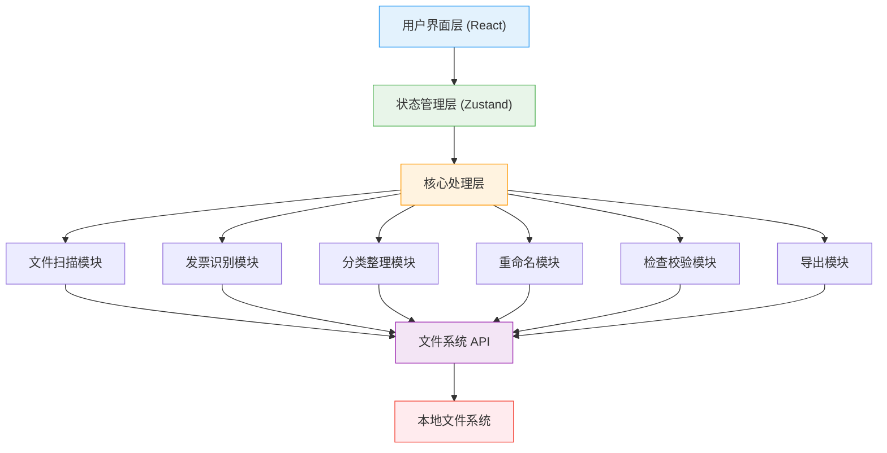
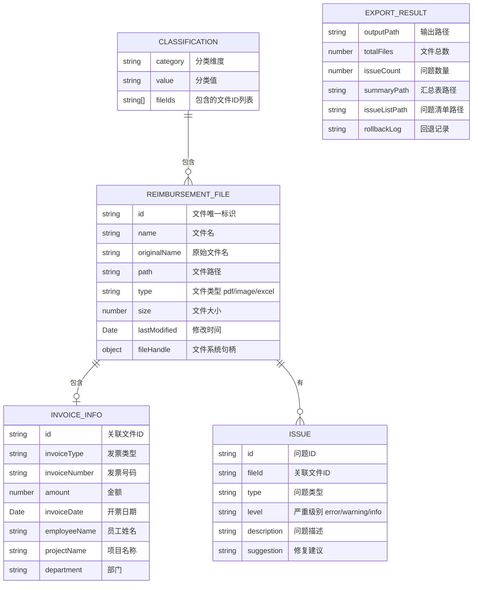

# 财务报销附件整理工具 - 技术架构文档

## 1. 架构设计

本工具采用纯前端单页应用架构，所有文件处理逻辑在浏览器端完成，无需后端服务。使用浏览器 File System Access API 实现本地文件的读取和写入，确保数据安全和处理效率。



## 2. 技术描述

### 2.1 前端技术栈

- **框架**: React@18 + TypeScript
- **构建工具**: Vite
- **样式方案**: TailwindCSS@3
- **状态管理**: Zustand
- **路由**: React Router（单页多步骤，可选）
- **图标**: Lucide React
- **UI 组件**: 自定义组件 + Headless UI

### 2.2 文件处理技术

- **文件读取**: File System Access API + File API
- **PDF 解析**: pdf.js（提取文本用于识别）
- **图片处理**: Canvas API（缩略图生成、基础图像分析）
- **Excel 导出**: SheetJS (xlsx)
- **ZIP 打包**: JSZip

### 2.3 识别方案

- **文件名解析**: 正则表达式匹配提取关键字段
- **PDF 文本提取**: pdf.js 提取文字后正则匹配
- **发票类型识别**: 基于关键词和模板的规则匹配
- **模拟识别**: 由于纯前端限制，提供模拟识别结果用于演示完整流程

## 3. 路由定义

| 路由 | 页面/组件 | 用途 |
|------|-----------|------|
| / | 主工作台 | 六步流程主界面，包含所有功能模块 |
| /settings | 设置页面 | 命名规则、分类规则、检查规则配置 |

> 注：由于是六步工作流，主要通过状态切换步骤面板，不涉及复杂路由。

## 4. 数据模型

### 4.1 核心数据结构



### 4.2 TypeScript 类型定义

```typescript
// 文件类型
type FileType = 'pdf' | 'image' | 'excel' | 'other';

// 发票类型
type InvoiceType = 'vat_special' | 'vat_general' | 'electronic' | 'receipt' | 'other';

// 问题严重级别
type IssueLevel = 'error' | 'warning' | 'info';

// 问题类型
type IssueType = 
  | 'duplicate'       // 重复票据
  | 'blank_file'      // 空白文件
  | 'amount_mismatch' // 金额不一致
  | 'missing_approval' // 缺少审批单
  | 'naming_issue';   // 命名不规范

// 报销文件
interface ReimbursementFile {
  id: string;
  name: string;
  originalName: string;
  path: string;
  type: FileType;
  size: number;
  lastModified: number;
  invoiceInfo?: InvoiceInfo;
  issues: Issue[];
  category: string;
}

// 发票信息
interface InvoiceInfo {
  invoiceType: InvoiceType;
  invoiceNumber: string;
  amount: number;
  invoiceDate: string;
  employeeName: string;
  projectName: string;
  department: string;
}

// 问题项
interface Issue {
  id: string;
  fileId: string;
  type: IssueType;
  level: IssueLevel;
  description: string;
  suggestion: string;
}

// 应用状态
interface AppState {
  currentStep: number;
  files: ReimbursementFile[];
  issues: Issue[];
  config: AppConfig;
  selectedFiles: string[];
}

// 配置项
interface AppConfig {
  namingTemplate: string;
  classificationRule: 'employee' | 'month' | 'amount' | 'project';
  amountRanges: { min: number; max: number; label: string }[];
  checkRules: CheckRules;
}
```

## 5. 核心模块设计

### 5.1 文件扫描模块

- 递归扫描选定目录下的所有文件
- 按扩展名分类（PDF、图片、Excel）
- 生成文件元数据（大小、修改时间等）
- 生成文件缩略图（图片和PDF首页）

### 5.2 发票识别模块

- 基于文件名的关键字提取（员工姓名、项目名等）
- PDF 文本提取 + 正则匹配发票信息
- 发票类型识别（增值税专票/普票、电子发票、收据等）
- 模拟识别结果生成（演示用）

### 5.3 分类整理模块

- 支持按员工姓名、月份、金额区间、项目名称分类
- 自动创建分类目录结构
- 文件归类映射关系管理

### 5.4 重命名模块

- 可配置的命名模板
- 支持变量：{员工姓名}_{月份}_{金额}_{发票类型}_{序号}
- 命名冲突自动处理（追加序号）
- 命名预览功能

### 5.5 检查校验模块

- **重复票据检测**：基于发票号码或文件内容哈希
- **空白文件检测**：文件大小为 0 或内容为空
- **金额一致性检查**：文件名金额与识别金额比对
- **审批单缺失检查**：同目录下缺少审批单文件
- **命名规范检查**：不符合命名模板的文件

### 5.6 导出模块

- 生成规范文件夹结构（按分类）
- 复制/移动文件到目标位置
- 生成 Excel 格式的报销汇总表
- 生成 Excel 格式的问题清单
- 生成可回退记录（JSON 格式，记录原始路径和新路径映射）

## 6. 状态管理设计

使用 Zustand 管理全局状态，按步骤组织状态切片：

```typescript
interface AppStore {
  // 步骤
  currentStep: number;
  setCurrentStep: (step: number) => void;
  
  // 文件
  files: ReimbursementFile[];
  addFiles: (files: ReimbursementFile[]) => void;
  updateFile: (id: string, updates: Partial<ReimbursementFile>) => void;
  
  // 问题
  issues: Issue[];
  runChecks: () => void;
  
  // 配置
  config: AppConfig;
  updateConfig: (config: Partial<AppConfig>) => void;
  
  // 导出
  exportResult: ExportResult | null;
  runExport: () => Promise<ExportResult>;
}
```
